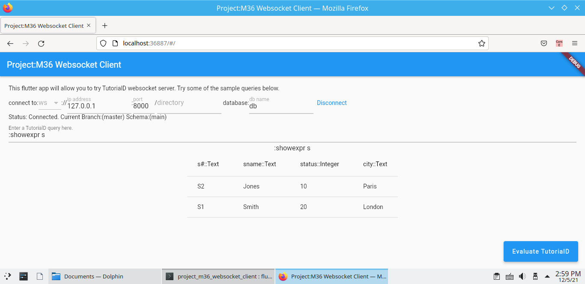

# project_m36_websocket_client

A Flutter web websocket client for [Project-M36](https://github.com/agentm/project-m36). 
It's also an attempt to bring algebraic datatypes into the Dart land.

 [Project-M36](https://github.com/agentm/project-m36) also has a javascript version of [websocket client](https://github.com/agentm/project-m36/blob/master/docs/websocket_server.markdown).

## Getting Started
1. `git clone` the repo.
2. `flutter pub get`
3. `flutter pub run build_runner build` to generate extra source codes. Here [freezed](https://pub.dev/packages/freezed) is used to represent ADTs.
4. `flutter -d web-server` (I failed to use `flutter -d chrome` in my nixos.)

## Known Issue
- `DataTable` can't have a flexible row height. So `RelationAtom` can't be well displayed by `DataTable`. Right now, it just show as a thumbnail. There is a [way](https://github.com/flutter/flutter/issues/70510#issuecomment-871105093) to fix it by adjusting the `_buildDataCell` method of `DataTable`, but I can't find a way to edit flutter source code in nixos.
